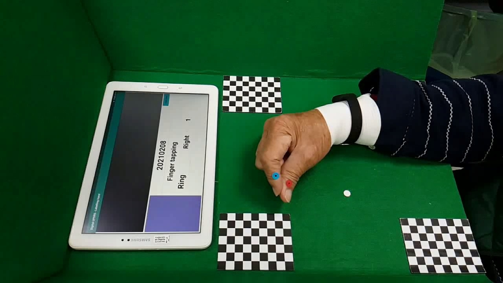
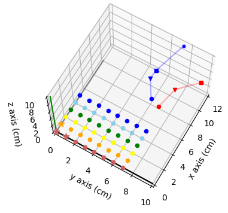
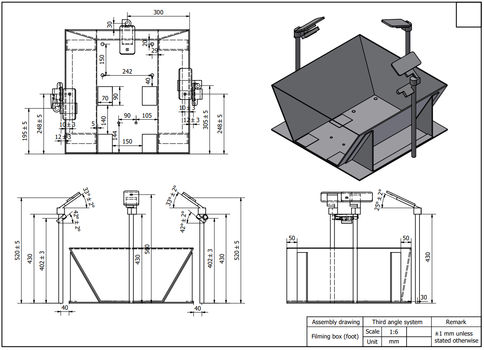
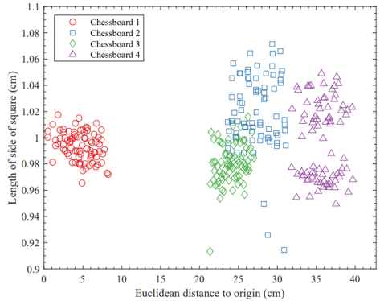

# Reconstuct 3D information using stereo system with OpenCV
This repository contains the script which can reconstruct the 3D information through a stereo vision system.
These scripts are designed for the experiment setup using in [Nordlinglab QPD project](https://www.nordlinglab.org/quantpd/)

## The stereo system and triangulation algorithm
The triangulation algorithm is a classic computer vision algorithm based on a stereo vision system.
If you are interested in the theory, using these keywords might help you to understand the scripts.


*Keywords: Stereo vision, Epipolar geometry, Camera matrix, Camera calibartion, Zhang's camera calibration algorithm, Triangulation*

In summary, reconsturt 3D information require:
1. A stereo vision system (two camera)
1. Camera matrix of these two cameras
1. A pair of corresponding points in both camera views

## How these scripts work
1. Camera calibration using pair-wise cameras (e.g. R_L, B_L, and B_R)
1. Using skin feature tracking to get the corresponding points in both camera view
1. Apply triangulation algorithm to reconstruct the 3D information of the object
1. Coordinate transformation, convert the origin point to the left upper chessboard

## Usage 
```
cd Script

python main.py
```
Note: If you use a different experiment setup, you need to record your own video for calibration and prepare your own CCP image.
[calibration video example](https://drive.google.com/drive/folders/1VFVJn--nOo_KBbEN7AZJOJACMgElzEjf?usp=sharing)

## Rsult
* The 2D tracking result from both camera view and the 3D tracking result:

    

* The origin point of the new coordinate system is at the left upper chessboard

  


## Appendix
* The experiment setup


* The accuracy of 3D reconstruct


## Reference
* Epipolar geometry: https://learnopencv.com/introduction-to-epipolar-geometry-and-stereo-vision/
* Camera matrix: https://learnopencv.com/geometry-of-image-formation/
* Camera calibartion: https://learnopencv.com/camera-calibration-using-opencv/


